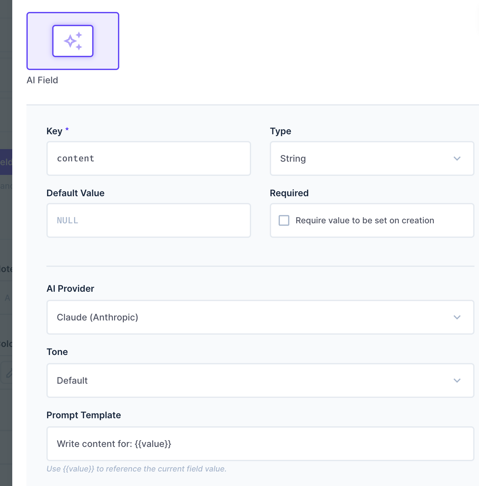

# directus-extension-ai-field

> Generate content with Claude, GPT, Gemini, Mistral, or DeepSeek directly inside any Directus field — no copy-pasting, no tab switching.



## Features

- **✦ Generate button** on any string or text field
- **5 AI providers** — Claude (Anthropic), GPT-4o mini (OpenAI), Gemini 2.0 Flash (Google), Mistral Small (Mistral AI), and DeepSeek Chat (DeepSeek)
- **Reference any field** in your prompt using `{{fieldName}}` syntax
- **Tone control** — formal, casual, technical, or default
- **Generation history** — last 3 results, click to restore
- **Regenerate** button to get a new result without retyping
- **Secure** — API keys stay on the server, endpoint requires Directus authentication

## Installation

```bash
cd your-directus-project/extensions
git clone https://github.com/mohammedwahba2/directus-extension-ai-field
cd directus-extension-ai-field
npm install
npm run build
```

Restart Directus after installation.

## Configuration

Add your API keys to your Directus `.env` (you only need the provider you plan to use):

```env
ANTHROPIC_API_KEY=your_key_here
OPENAI_API_KEY=your_key_here
GEMINI_API_KEY=your_key_here
MISTRAL_API_KEY=your_key_here
DEEPSEEK_API_KEY=your_key_here
```

## Usage

1. Go to **Settings → Data Model**
2. Open any collection and add or edit a **String** or **Text** field
3. Under **Interface**, choose **AI Field**
4. Pick your provider, tone, and prompt template
5. Save — the **✦ Generate** button will appear on every item

## Prompt Templates

Use `{{value}}` to reference the current field value, or `{{fieldName}}` to reference other fields in the same item:

```
Write an SEO meta description for: {{title}} in category {{category}}
```

```
Summarize the following article in 2 sentences: {{body}}
```

```
Translate to Arabic: {{value}}
```

## Options

| Option | Description | Default |
|---|---|---|
| Provider | Claude, GPT, Gemini, Mistral, or DeepSeek | Claude |
| Tone | default, formal, casual, technical | default |
| Prompt Template | Template with `{{value}}` or `{{fieldName}}` | `Write content for: {{value}}` |
| Max Tokens | Max length of generated content (1–4096) | 500 |

## Requirements

- Directus 11+
- Node.js 22+
- API key for at least one provider

## Security

- API keys are stored in environment variables and never sent to the browser
- The `/generate` endpoint requires a valid Directus session (any logged-in user)
- To restrict generation to specific roles, add a permission check in `src/endpoint/router.ts`

## Troubleshooting

**"ANTHROPIC_API_KEY is not configured"** — Add the key to your `.env` and restart Directus.

**"Unauthorized"** — Make sure you're logged in to Directus before using the generate button.

**Empty output** — Try increasing Max Tokens in the field options.

**Build errors** — Make sure you're on Node.js 22+ and ran `npm install` inside the extension folder.   